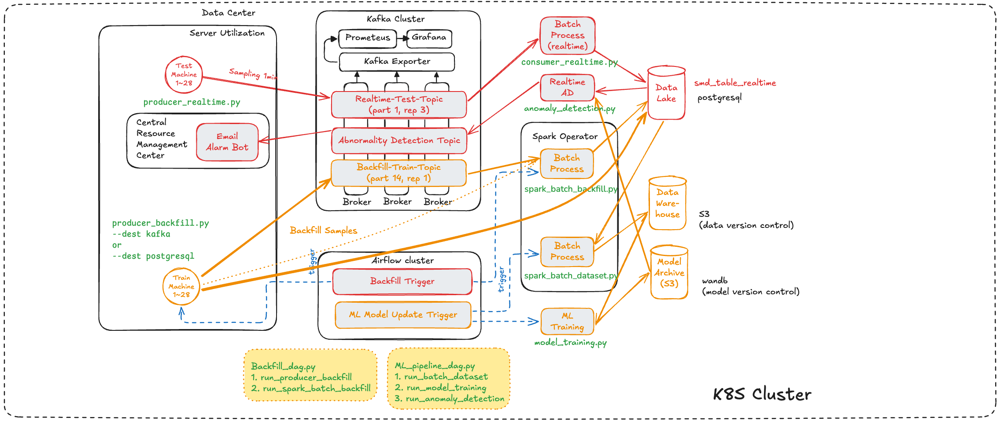

# KAS-on-M3K

## 1. Install M3K cluster
Setting up with Port exposure and Host volume 
```bash
minikube start \
    --profile=<MINIKUBE_PROFILE_NAME>
    --driver=docker \
    --cpus=24 \
    --memory=200g \
    --container-runtime=docker \
    --gpus=all \
    # 아래 경로중 하나만 가능 (minikube는 한 번에 하나의 mount만 처리)
    # --mount \
    # --mount-string="<HOSTPATH_KAFKA>:/opt/kafka" \
    # --mount \
    # --mount-string="<HOSTPATH_AIRFLOW>:/opt/airflow" \
    # --mount \
    # --mount-string="<HOSTPATH_SPARK>:/opt/spark" \
```
```bash
# 3개 경로를 모두 추가하려면 이와 같이 별도 요청
minikube mount --profile m16 <HOSTPATH_KAFKA>:/opt/kafka & # 터미널 1
minikube mount --profile m16 <HOSTPATH_AIRFLOW>:/opt/airflow & # 터미널 2
minikube mount --profile m16 <HOSTPATH_SPARK>:/opt/spark & # 터미널 3
```
```bash
minikube ssh -p <MINIKUBE_PROFILE_NAME> # 접속해서 경로 직접 확인
```
- 호스트로 포트 오픈하기
```bash
minikube -p <MINIKUBE_PROFILE_NAME> service <SVC_NAME> -n <NAMESPACE>
minikube -p m16 service list
```

### 1.1. Install kubectl
ref: https://kubernetes.io/docs/tasks/tools/install-kubectl-linux/ 

in ~/.bashrc
```bash
alias kubectl="minikube kubectl --"
```
### 1.2. Kubectl Context and Minikube Profile with Config (KUBECONFIG) and Env(MINIKUBE_HOME)
정석적인 방법은 context와 profile 을 이용하는 방법!

```bash
# kubectl:
kubectl config get-contexts
kubectl config use-context <context_name>
# Minikube:
minikube -p <profile_name> status
minikube start -p <profile_name>
minikube delete -p <profile_name>
```
### 1.3. Check GPU Access from Pod nvidia-smi
> nvidia-smi-check.yaml
```yaml
apiVersion: v1
kind: Pod
metadata:
  name: nvidia-smi
  namespace: default
spec:
  restartPolicy: Never
  containers:
    - name: nvidia-smi
      image: nvidia/cuda:12.2.0-base-ubuntu22.04   # ✅ CUDA 베이스 이미지
      command: ["nvidia-smi"]
      resources:
        limits:
          nvidia.com/gpu: 1                        # ✅ GPU 요청 (필수)
```
```bash
kubectl create -f nvidia-smi-check.yaml
```

## 2. Install Kafka
```bash
helm repo add \
    bitnami https://charts.bitnami.com/bitnami
helm repo update
```
```bash
helm install kafka bitnami/kafka \
  --namespace kafka \
  --create-namespace \
  -f values.yaml
```
### 2.1. kafka-ui (manual install)
```bash
# kubectl create namespace kafka
kubectl apply -f kafka-ui.yaml
minikube -p <MINIKUBE_PROFILE_NAME> service kafka-ui -n kafka
# 192.168.xx.xx:30095
```

## 3. Producer and Consumer for Kafka Test
### 3.0. Customize App Images
**Producer**
```bash
# docker build -f Dockerfile.producer -t dwnusa/smd-producer:v0.0.1-amd64 .
docker build \
  --no-cache \
  -f Dockerfile.producer \
  -t dwnusa/smd-producer:v0.0.2-amd64 .

docker push dwnusa/smd-producer:v0.0.2-amd64

kubectl run smd-producer \
  --restart='Never' \
  --image-pull-policy='Always' \
  --image dwnusa/smd-producer:v0.0.2-amd64
```
**Consumer**
```bash
# docker build -f Dockerfile.consumer -t dwnusa/smd-consumer:v0.0.1-amd64 .
docker build \
  --no-cache \
  -f Dockerfile.consumer \
  -t dwnusa/smd-consumer:v0.0.2-amd64 .

docker push dwnusa/smd-consumer:v0.0.2-amd64

kubectl run smd-consumer \
  --restart='Never' \
  --image-pull-policy='Always' \
  --image dwnusa/smd-consumer:v0.0.2-amd64
```
### 3.1. Create Topic 
```bash
# Topic 생성
```bash
kubectl exec -it kafka-controller-0 -n kafka \
  -- kafka-topics.sh --create \
  --topic server-machine-usage \
  --bootstrap-server kafka.kafka.svc.cluster.local:9092 \
  --replication-factor 3 \
  --partitions 1

kafka-topics.sh --list --bootstrap-server kafka.kafka.svc.cluster.local:9092
```


## 4. Install Airflow (version 3.xx)
### 4.0. Customize Airflow Image
```bash
docker build -t dwnusa/airflow:v3.0.2-jdk17-pyspark-3.5.5-amd64 .
```
### 4.1. Mount PV, PVC
```bash
kubectl create -f pv-airflow.yaml
kubectl create -f pvc-airflow.yaml -n airflow
```
### 4.2. Helm Install Airflow
```bash
helm repo add \
  --force-update apache-airflow https://airflow.apache.org
helm repo update
```
```bash
helm upgrade \
  --install airflow apache-airflow/airflow \
  --namespace airflow \
  -f airflow-values.yaml

# or 

# helm upgrade --install airflow apache-airflow/airflow  \
#     --namespace airflow \
#     --create-namespace \
#     --set dags.persistence.enabled=true \
#     --set dags.persistence.existingClaim=airflow-dags \
#     --set airflow.extraPipPackages="{apache-airflow-providers-apache-spark,apache-airflow-providers-cncf-kubernetes}" \
#     --set postgresql.image.tag=latest
```
### 4.3. RBAC for cross namespace between airflow and spark-operator
```bash
kubectl create -f airflow-spark-rbac.yaml
```

### 4.4. Open NodePort Access
```bash
kubectl patch svc airflow-api-server -n airflow \
  -p '{"spec": {"type": "NodePort", "ports": [{"port": 8080, "targetPort": 8080, "nodePort": 30097}]}}'
```

## 5. Install Spark (version 3.xx)
### 5.0. Customize Spark Image
```bash
docker build -t dwnusa/spark:v3.5.4-amd64 .
```
### 5.1. Helm Install Spark
```bash
helm repo add \
  --force-update spark-operator https://kubeflow.github.io/spark-operator
helm repo update
```

- job script 경로는 sparkapp 용 yaml 파일에서 정의하고 airflow namespace 에서 관리
- airflow-spark-rbac 설정으로 airflow 가 spark-operator 자원을 접근하도록 허용

```bash
helm install spark-operator spark-operator/spark-operator \
  --namespace spark-operator \
  --create-namespace \
  --set sparkJobNamespace=default \
  --set rbac.create=true \
  --set webhook.enable=true \
  --set serviceAccounts.spark.name=spark \
  --wait
```

## 6. Connect to airflow-postgres 

> **Note:** The RBAC setup required for cross-namespace access between Airflow and Spark Operator was already applied in [Section 4.3](#43-rbac-for-cross-namespace-between-airflow-and-spark-operator).

```bash
kubectl create -f airflow-spark-rbac.yaml
```

If PostgreSQL (or other containers) are supposed to run independently in the `default` namespace,  
you may also need to apply an additional RBAC configuration:

```bash
kubectl create -f airflow-default-rbac.yaml
```

## 7. Install postgresql (docker)

```bash
mkdir -p /home2/dwnusa/pgdata
chmod 700 /home2/dwnusa/pgdata

docker run -d \
  --name pg16 \
  -e POSTGRES_USER=postgres \
  -e POSTGRES_PASSWORD=postgres \
  -e POSTGRES_DB=testdb \
  -v /home2/dwnusa/pgdata:/var/lib/postgresql/data \
  -p 12345:5432 \
  postgres:16
```

| 옵션                                                  | 의미                                  |
| --------------------------------------------------- | ----------------------------------- |
| `-v /home2/dwnusa/pgdata:/var/lib/postgresql/data`  | 데이터를 `/home2/dwnusa/pgdata` 에 영구 저장 |
| `-p 12345:5432`                                     | 외부 접속 포트를 12345로 변경                 |
| `POSTGRES_USER`, `POSTGRES_PASSWORD`, `POSTGRES_DB` | 초기 사용자/DB 설정                        |

> 이후 컨테이너를 지워도 /home2/dwnusa/pgdata 안의 데이터는 남습니다.

```bash
psql -h <PUBLIC_IP> -p 12345 -U postgres -d testdb
```
```python
import psycopg2
conn = psycopg2.connect(
    host=<PUBLIC_IP>,
    port=55432,
    user="postgres",
    password="postgres",
    dbname="testdb"
)
print(conn)
```

## Diagram


## Todolist
[ ] logger 필요함 (단순 print 만으로는 부족)
[ ] try catch 자세하게 적용

[ ] PCA 사용하여 정보량이 높은 feature 확인하기 (sklearn container)
```python
from sklearn.decomposition import PCA
import pandas as pd

X = df[new_column_names].fillna(0)
pca = PCA(n_components=10)
pca.fit(X)

importance = abs(pca.components_[0])  # 첫 번째 주성분의 기여도
feature_importance = pd.Series(importance, index=new_column_names).sort_values(ascending=False)
print(feature_importance.head(10))
```
[ ] VAE (OmniAD 알고리즘 테스트, nvidia and pytorch container)